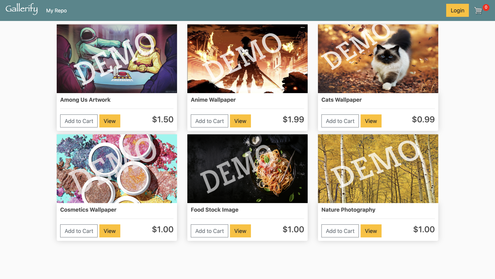
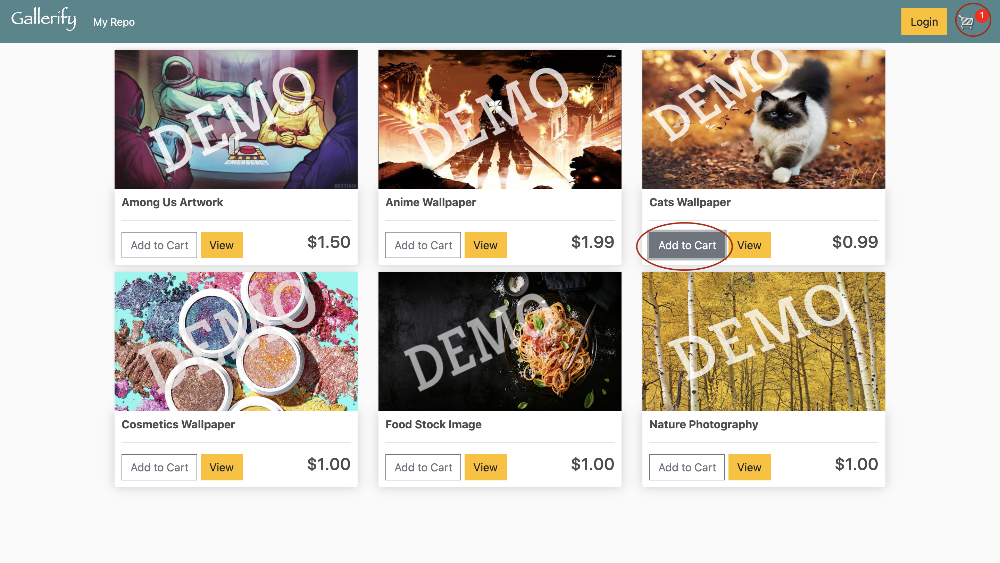
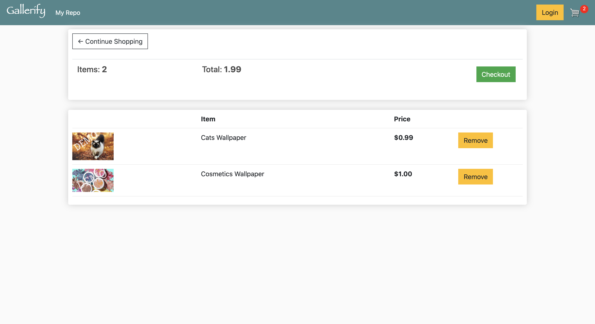
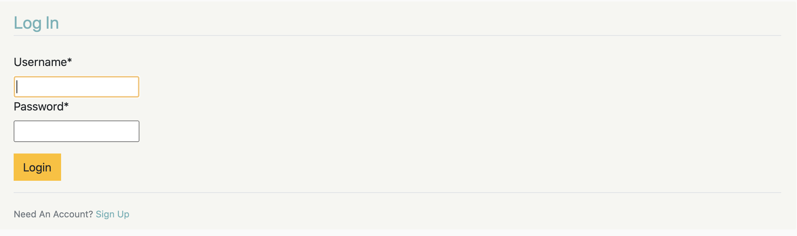
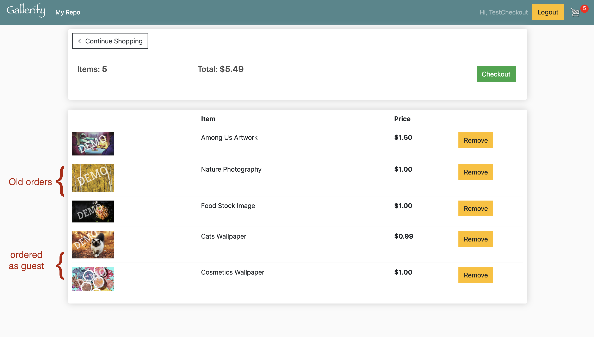
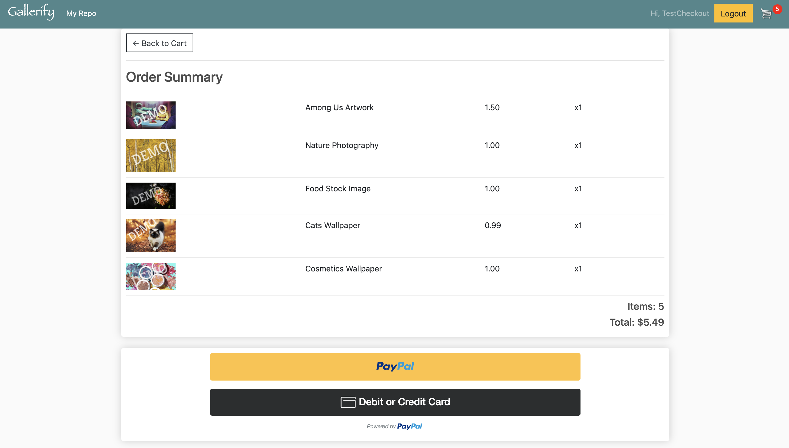
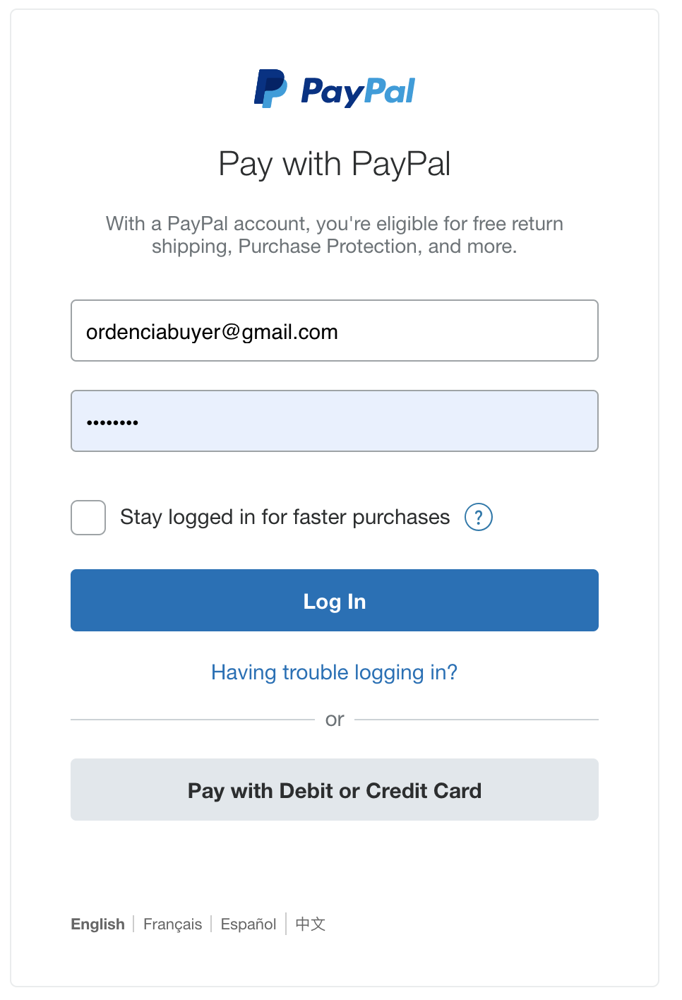
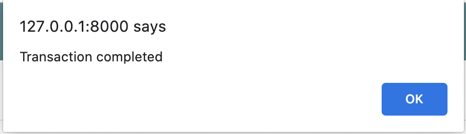
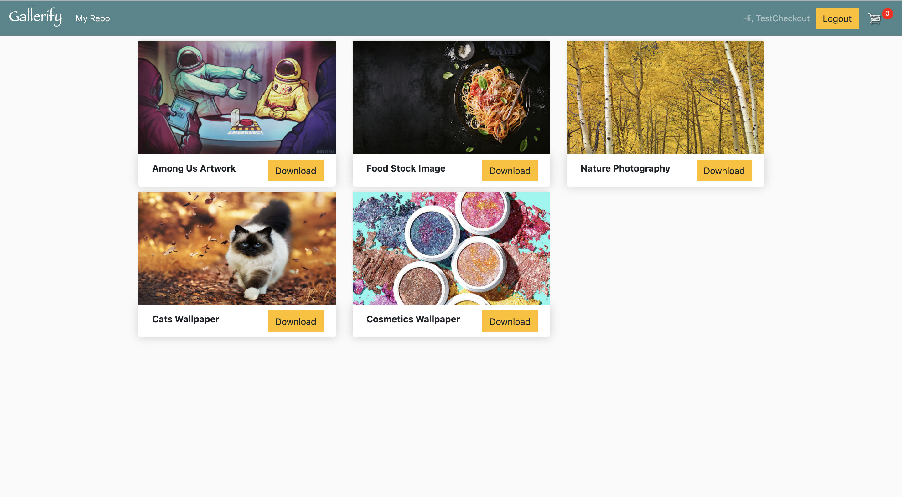
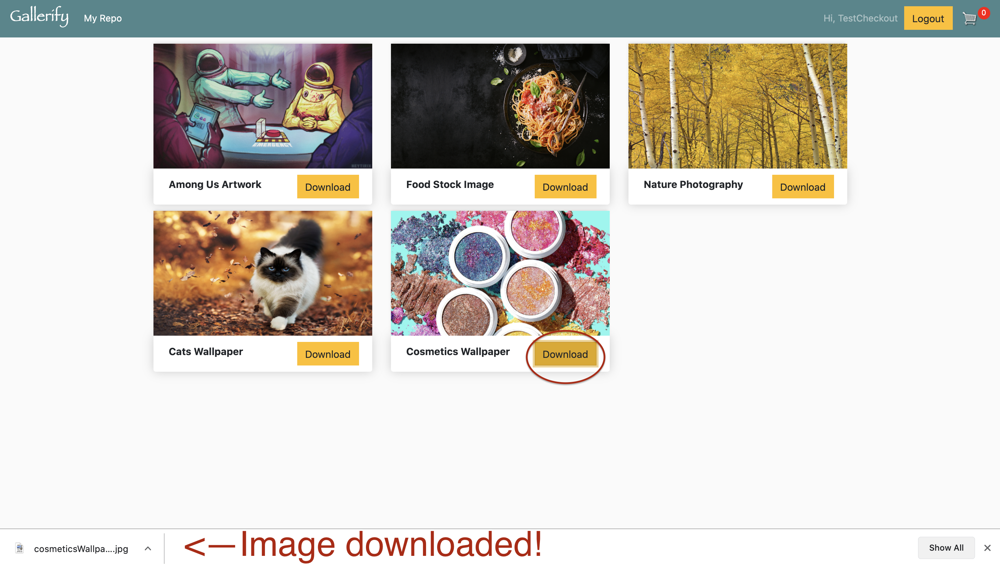

# Gallerify - your image repository

Explore a selection of the best photos, images, designs, and illustrations; shop the most eye-catching items and add them to your repository :)

## Technologies

This app was built with Django

## What I learned
- Build an e-shop web application featuring user authentication, product page, shopping cart, and check out modules

- Support switching between guest and user by adding cookies

- Define models and views, design templates, and implement routing with Django framework

- Manage site with Django admin page

- Leveraged Paypal to support payments; add theft prevention during checkout

## Features
Home Page (owner put custom watermarkes on the items, no image theft:)

Try adding items to cart

Your items are in your cart now

We want you to always have access to your items so creating an account is required before making a purchase 
Upon clicking checkout, guests are prompted to login or sign up. After logging in, users can proceed to checkout

Forgot to log in before adding items to cart? Or forgot to checkout a previous order while logged in? 
Don't worry, Gallerify remembers your orders

Confirm your order and checkout

Make a payment with paypal

After the success alert, you will get directed to your new repo

You can download your images with watermarks removed from the repo now, enjoy!

## Thank you for shopping with Gallerify
